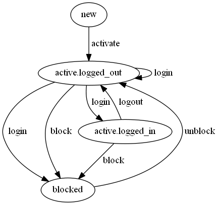

# StateMachine
Easy to use state machine to manage the state of python objects.




## Introduction
This state machine implementation is developed with the following goals in mind:

* Easy to use API, for configuration of the state machine and triggering state transitions,
* Usable for any (almost, I'm sure) python class with a finite number of states,
* Fully featured, including nested states, conditional transitions, shorthand notations, many ways to configure callbacks,
* Simple state machines do not require advanced knowledge; complexity of configuration scales with complexity of requirements, 
* One state machine manages the state of all instances of a class; the objects only store their current state as a string,
* Option to use multiple interacting state machines in the same class, with no added complexity,
* Optimized for speed and memory efficient.

## Installation
To install the module you can use: `pip install states3`. It has no external dependencies, except optionally `graphviz` for creating an image of your state machine. 

## Limitations
This module only runs on Python >= 3.6.

## Concepts

The following basic state machine concepts are used:

* *state machine*: system that manages the states of objects according to predefined states and transitions,
* *state*: state of an stateful object; objects can be in one state at the time,
* *transition*: transition of the object from one state to another,
* *trigger*: (generated) method called on an object that triggers a state transition,
* *callback*: different functions called on state transitions by the state machine,
* *condition*: conditions that allow a specific state transition to take place.

## Code Example

Here is a simple state machine to give some idea of what the configuration looks like.
```python
from states import state_machine, StatefulObject, states, state, transition

class LightSwitch(StatefulObject):
    state = state_machine(
        states=states('off', 'on'),
        transitions=[
            transition('off', 'on', trigger='flick'),
            transition('on', 'off', trigger='flick'),
        ],
    )
    
    @state.on_entry('on', 'off')
    def print(self, name):
        print(f"{name} turned the light {self.state}")    
    
lightswitch = LightSwitch(state="off") 
lightswitch.flick(name="Bob")  # prints: "Bob turned the light on"
lightswitch.flick(name="Ann")  # prints: "Ann turned the light off"   
```
> Note that this configuration works for the versions >= 0.5.0.

## Features
The module has the following basic and some more advanced features:

* enable _triggering_ state transitions by setting trigger name(s) in machine configuration:
    * same trigger can be set for different transitions,
    * when a trigger method is called it passes its arguments to all callbacks (e.g. `on_exit`, `on_entry`),
* _conditional transitions_ can be used to change state depending on condition functions,
    * if a transition is triggered, but the condition is not met, the transition does not take place
    * to do this, create multiple transitions from the same state to different states and give them different conditions
* A large number of _callbacks_ can be installed *when needed*. Examples are `on_entry` of a state, `on_exit` of a state `on_transfer` on a specific transition between states, `condition` on a transition. More info in the section "On Callbacks",
* _callbacks_ can be methods on the class of which the state is managed by the machine, with 2 options:
    * The callback is configured as a string (e.g. `active=state("on_entry": "do_callback")`) in state machine definition, that is looked op on the stateful class,
    * The callback is a decorated method of the class (e.g. `@machine.on_entry('active')` with `active` the state name being entered),
* _wildcards_ (`*`) and listed states can be used to define (callbacks for) multiple transitions or at once:
    * for example transition `transition(["A", "B"], "C")` would create 2 transitions, on from A to C and one from B to C; `transition("*", "C")` would create transitions from all states to C,
* _nested_ states can be used to better organize states and transitions, states can be nested to any depth,
* _multiple_ state machines can be used in the same class and have access to that class for callbacks, a single trigger can result in callbacks through multiple machines,
* a _context manager_ can be defined on state machine level to create a context for each transition,
* *constraints* can be defined on a state, basically setting conditions on all transitions to that state,
* custom _exceptions_:
    * `MachineError`: raised at initialization time in case of a misconfiguration of the state machine,
    * `TransitionError`: raised at run time in case of, for example, an attempt to trigger a non-existing transition,
* Basic support to draw states and transitions using `graphviz`.

---

## Tutorial
 This section we will show an example that shows most of the features of the state machine. We will introduce features step-by-step. 

 Lets define a simple User class, say for getting access to an application:

 ```python
from states import StatefulObject, state_machine

class User(StatefulObject):
    state = state_machine(...)

    def __init__(self, username, state='somestate'):
        super().__init__(state=state)
        self.username = username
        self.password = None
 ```


* Class `StatefulObject` sets one class attribute and adds trigger methods to the `User` class when these are defined.
* `state_machine` is the factory function that takes a configuration and turns it in a fully fledged state machine.
* Notice you can set the initial state through the `state` (or any other name you gave the state machine), argument of `__init__`.

lets add some states: 
* `new`: a user that has just been created, without password, etc.
* `active`: a user that is active on the server, has been authenticated at least once, ...
* `blocked`: a user that has been blocked access for whatever reason.

 ```python
from states import StatefulObject, state_machine, states

class User(StatefulObject):
    state = state_machine(
        states=states('new', 'active', 'blocked')
    )

    def __init__(self, username):
        super().__init__(state='new')
        self.username = username
        self.password = None
 ```

* `state_machine` takes a parameter `states`, preferable created with the `states` function that returns a validated dictionary.
* The initial state can be set as above; if not given, the first state of the state machine will be the initial state,
* In this example transitions will be automatically added to the state machine. All possible transitions and related triggers are generated and can be called as `goto_[statename](...)`, so e.g. `user.goto_active(...)`,
* `states('new', 'active', 'blocked')` is shorthand for `states(new=state(), active=state(), blocked=state())`; the longer form is only needed when extra configuration of the states is needed,

Most of the time you might want to define the transitions yourself, to configure them and to limit possible transitions (e.g. reduce the chance of users logging in without password).

```python
from states import StatefulObject, state_machine, states, transition

class User(StatefulObject):
    state = state_machine(
        states=states('new', 'active', 'blocked'),
        transitions=[
            transition('new', 'active', trigger='activate'),
            transition('active', 'blocked', trigger='block'),
            transition('blocked', 'active', trigger='unblock'),
        ]   
    )

    def __init__(self, username):
        super().__init__(state='new')
        self.username = username
        self.password = None

user = User('rosemary')
user.activate()
assert user.state == 'active'  # this is the current state of the user
```

* We add a an argument `transitions` to the state machine with from- and to states, and a trigger name that can be called to trigger the transition.
* The `transition` items in the `transitions` list are validating functions returning a dictionary,
* The transitions limit the possible transition between states to those with transitions defined on them; if e.g. `user.activate()` was called again, a `TransitionError` would be raised, because there is not transition between 'active' and 'active',
* We also created a user, with initial state 'new' and triggered a transition: `user.activate()`, after which the user had the new state 'active'.
* trigger functions like `User.activate()` and `User.block()` are auto-generated during state machine construction, 
* Similarly, now the user has state 'active', we could call `user.block()` and after `user.unblock()`, but only in that order,
However, a user needs to have a password to be 'active'. Lets use `activate` to set the password of the user (leaving out the `__init__` method, it will stay the same for now):

```python
from states import StatefulObject, state_machine, states, transition

class User(StatefulObject):
    state = state_machine(
        states=states('new', 'active', 'blocked'),
        transitions=[
            transition('new', 'active', trigger='activate'),
            transition('active', 'blocked', trigger='block'),
            transition('blocked', 'active', trigger='unblock'),
        ]   
    )
    ...
    @state.on_entry('active')
    def set_password(self, password):
        self.password = password

user = User('rosemary')
user.activate(password='very_secret')

assert user.state == 'active'
assert user.password == 'very_secret'
```

* The decorator `@state.on_entry('active')` basically sets `set_password` to be called on entry of the state `active` by the user.
* Remember that to go to the state 'active' the trigger function`user.activate(...)` needs to be called:
    * All arguments passed to the trigger function will be passed to ALL callbacks that are called as a result,
    * Tip: use keyword arguments in callbacks and when calling trigger functions in other than trivial cases,
    * if there are multiple arguments needed by different callbacks, they can be defined like e.g. `callback(used_args, .., **ignored)` to ignore all unneeded arguments by this callback, but possibly needed by others.
* We can similarly set callbacks for `on_exit`, `on_stay`.

To make the possibilities of callbacks clearer, let's have some more:

```python
from states import StatefulObject, state_machine, states, transition

class User(StatefulObject):
    state = state_machine(
        states=states('new', 'active', 'blocked'),
        transitions=[
            transition('new', 'active', trigger='activate'),
            transition('active', 'blocked', trigger='block'),
            transition('blocked', 'active', trigger='unblock'),
        ]   
    )
    ...
    
    def set_password(self, password):
        self.password = password

    @state.on_entry('*')  # on_entry of all states
    def print_transition(self, **ignored):
        print(f"user {self.username} went to state {self.state}")
    
    @state.on_exit('active')  # called when exiting the 'active' state
    def forget_password(self, **ignored):
        self.password = None

    @state.on_transfer('active', 'blocked')
    def do_something(self, **ignored):
        pass

```
* A wildcard `*` can be used to indicate all states (or sub-states, as in 'active.*' , more on that later),
* for callback decorators `on_entry`, `on_exit` and `on_stay`, multiple comma separated states can be given (e.g. `@state.on_exit('new', active')`) and the callback will be installed on each state,
* If an action is required on a specific transition, this can be achieved with  `@state.on_transfer(old_state, new_state)`; if too many `on_transfer` callbacks are required on a state machine, there might be a problem in the state definitions, 

To make this state machine a bit more useful, let us include a basic login process. To do this we will add 2 sub-states to the 'active' state:

```python
from states import StatefulObject, state_machine, states, transition, state

class User(StatefulObject):
    state = state_machine(
        states=states('new', 'blocked',
                      active=state(states=states('logged_out', 'logged_in'))),
        transitions=[
            transition('new', 'active', trigger='activate'),
            transition('active', 'blocked', trigger='block'),
            transition('blocked', 'active', trigger='unblock'),
        ]   
    )
    ...
    @state.on_entry('active')
    def set_password(self, password):
        self.password = password

```
*  Notice `active=state(states=states('logged_out', 'logged_in'))`:
    * the sub_state has the same configuration as the main state machine, 
    * but instead of `state_machine` we will use the function `state` returning a dictionary,
    * actual construction of the sub-states is left to the main `state_machine`
* the transition `transition('new', 'active', trigger='activate')` will now put the user in the `active.logged_out` state (because it is first in the list of sub-states of `active`)
* the transition `transition('active', 'blocked', trigger='block')` will put the user in the `blocked` state independent of the `active` sub-state the user was in,

Of course the user needs to be able to login and logout and during login, a password must be checked:

```python
from states import StatefulObject, state_machine, states, transition, state

class User(StatefulObject):
    state = state_machine(
        states=states(
            new=state(),  # default: exactly the same result as using just the state name
            blocked=state(),
            active=state(
                states=states('logged_out', 'logged_in'),
                transitions=[
                    transition('logged_out', 'logged_in', trigger='log_in'),
                    transition('logged_out', 'logged_out', trigger='log_in'),
                    transition('logged_in', 'logged_out', trigger='log_out')
                ]
            )
        ),
        transitions=[
            transition('new', 'active', trigger='activate'),
            transition('active', 'blocked', trigger='block'),
            transition('blocked', 'active', trigger='unblock'),
        ]   
    )
    ...
    @state.on_entry('active')
    def set_password(self, password):
        self.password = password

    @state.condition('active.logged_out', 
                     'active.logged_in')
    def verify_password(self, password):
        return self.password == password

    @state.on_entry('active.logged_in')
    def print_welcome(self, **ignored):
        print(f"Welcome back {self.username}")

    @state.on_exit('active.logged_in')
    def print_goodbye(self, **ignored):
        print(f"Goodbye {self.username}")

    @state.on_transfer('active.logged_out', 
                       'active.logged_out')
    def print_sorry(self, **ignored):
        print(f"Sorry, {self.username}, you gave an incorrect password")


user = User('rosemary').activate(password='very_secret').log_in(password='very_secret')
assert user.state == 'active.logged_in'

user = User('rosemary').activate(password='very_secret').log_in(password='wrong_secret')
assert user.state == 'active.logged_out'
```

* With `@state.condition(...)` a conditional transition is introduced:
    * this means that the transition only takes place when the decorated method returns `True`,
    * So, what if the condition returns `False`?
        - During state machine initialization, a check for a default transition (without condition) takes place,
        - if not found, an unconditional transition back to the original state is auto-generated, 
        - in this case, because we wanted to add the callback with `@state.on_transfer('logged_out', 'logged_out')`, we needed to explicitly add this (default) transition to the state machine,
        - this transition is executed when the conditions fails.
* Note that the triggers can be chained `User(...).activate(...).log_in(...)`, the trigger functions return the object itself,
* A function can have multiple callback decorators applied to it; also the same decorator can be applied to multiple callback functions,
  
* This completes a basic state machine for the user flow for application access, it might seem little code, but it accomplished quite a lot:
    * The user must provide a password to become active,
    
    * the user must be active to be able to log in,
    
    * the user must provide the correct password to login,
    
    * the user is be provided with different feedback for each occasion, 
    
    * the user can be blocked and unblocked and he/she cannot login when blocked.
    
      

> **Intermezzo: another way to configure conditional transitions (and other callbacks) **
>
> For clarity sake there is another way to configure conditional transitions:
>
> ```python
> from states import states, transition, state, case, default_case
> 
> active=state(
>     states=states('logged_out', 'logged_in'),
>     transitions=[
>         transition('logged_out', [case('logged_in', condition='verify_password'),
>                                   default_case('logged_out')],
>                    trigger='log_in'),
>         transition('logged_in', 'logged_out', trigger='log_out')
>     ]
> )
> ```
>
> * The second argument of `transition` is replaced with a list of cases, indicating different end states of the transition,
> * `case` and `default_case` are function that help configuration (e.g. validate); they define the states the transition might lead to and return dictionaries,
> * `condition='verify_password'` refers to the method `verify_password` on the state managed object. If the condition argument is a string it will be looked up on the (in this case) User class. If it's a function, it will be used as is,
> * Similarly other callbacks can be configured directly in the state machine config (not through decorators). For example you could do `active=state(on_entry='set_password', ...)`,
> * This way of configuration is especially useful for conditional transitions, because they are part of the 'structure' of the state machine; the other callbacks are (in my mind) better added through decorators, for clarity sake.


Let's extend the example one more time:

* We want to block the user after 5 failed login attempts (because 3 is soo limiting ;-)
* Let's add a 'deleted' state for users you want to get rid of (for some reason),
* Let's also add some logging, we want to know about state transitions,
* We'll leave out the messages, to keep focus on the task at hand.

```python
import logging

from states import StatefulObject, state_machine, states, transition, state

logger = logging.getLogger(__name__)

class User(StatefulObject):
    state = state_machine(
        states=states(
            new=state(),  # default: exactly the same result as using just the state name
            blocked=state(),
            active=state(
                states=states('logged_out', 'logged_in'),
                transitions=[
                    transition('logged_out', 'logged_in', trigger='login'),
                    transition('logged_in', 'logged_out', trigger='logout')
                ]
            ),
            deleted=state(),
        ),
        transitions=[
            transition('new', 'active', trigger='activate'),
            transition('active', 'blocked', trigger='block'),
            transition('active.logged_out', 'blocked', trigger='login'),
            transition('blocked', 'active', trigger='unblock'),
            transition('*', 'deleted', trigger='delete'),
        ]
    )

    def __init__(self, username, max_logins=5):
        super().__init__(state='new')
        self.username = username
        self.password = None
        self.max_logins = max_logins
        self.login_count = 0

    @state.on_entry('active')
    def set_password(self, password):
        self.password = password

    @state.constraint('active.logged_in')
    def verify_password(self, password):
        return self.password == password

    @state.condition('active.logged_out',
                     'blocked',
                     trigger='login')
    def check_login_count(self, **ignored):
        return self.login_count >= self.max_logins

    @state.on_transfer('active.logged_out',
                       'active.logged_out')  
    def inc_login_count(self, **ignored):
        self.login_count += 1

    @state.on_exit('blocked')
    @state.on_entry('active.logged_in')
    def reset_login_count(self, **ignored):
        self.login_count = 0
        
    @state.after_entry()
    def do_log(self, **ignored):
        logger.info(f"user went to state {self.state}")


user = User('rosemary').activate(password='very_secret')

for _ in range(user.max_logins):
    user.login('wrong')
    assert user.state == 'active.logged_out'

user.login('wrong')  # one time too many
assert user.state == 'blocked'

```
* We count login attempts when the user goes from `active.logged_out` back to `active.logged_out` and reset the count on any successful login,
* in `check_login_count` we check whether the login count has exceeded the maximum,
* Notice that the decorator above  `check_login_count()` includes the trigger `login`, this is because there is another transition from `active.logged_out` to `blocked` with trigger `block`. The state machine will raise a `MachineError` when there is more then a single possible transitions to add the condition to,
* Notice also that we have replaced the `@state.condition('active.logged_out', 'active.logged_in')` decorator with the `@state.constraint('active.logged_in')`, decorator; a way to restrict all transitions going into a state (`active.logged_in` in this case),
* The `@state.after_entry('somestate')` decorator applies to any entry of a (sub-) sub-state of the state. No argument means the root state machine: `@state.after_entry()`. Similarly there is `@state.before_exit(...)`. 

**Options & Niceties**

The state machine has a couple of other options and niceties to enhance the experience:

* A prepare callback that if present will be called before any transition: the `@[state machine name].prepare` decorator will install it on the machine. Note that the decorator takes no arguments,

* A context manager callback that if present, can create a context for all transitions: it can be installed as follows:

  ```python
  @[state machine name].contextmanager
  def some_context(obj, *args, **kwargs):
      ...  # initialize context
      yield context
      ...  # finalize context
  ```

  *Important*: it will pass the context as a keyword argument to all callbacks called within the transitions (all but `prepare`), so the callbacks must be able to take the `context` argument, as in for example:

  ```python
  @some_machine.on_exit('somestate')
  def some_callback(obj, context, ...):
      pass  # do something with the context
  ```

   or

  ```python
  @some_machine.on_exit('somestate')
  def some_callback(obj, some_args, **ignored):
      pass  # ignore the context
  ```

* You can save the graph of the state machine in different formats using `.save_graph(filename, **options)` as in:

  ```python
  User.state.save_graph('user_state.png')  # see image at top of readme
  ```

   The options are passed to `graphviz` as the options for the graph itself. It must be installed on your system; see [graphviz](https://graphviz.readthedocs.io/en/stable/manual.html).

---

## On Callbacks

Callbacks like `on_entry` are part of what makes the use of a state machine so powerful. Here we will give a full list of all callbacks, a way to add them to the state machine through decorators and when they will be called. 

On callback arguments: 

* all callbacks must have as first argument the object of which the state is managed; if the callback is a method on the class of the object, this is automatic: the `self` argument,
* The callbacks are called as a result of calling a trigger on the state managed object (`user.activate(password=password)`). All arguments with which the trigger is called are passed to all resulting callbacks,
* otherwise callbacks can be defined with any arguments (`*args`, `**kwargs`). 

So in general the installation of a callback on a state machine looks something like this:

```python
@[machine_name].[decorator_name](*state_names[, trigger='some_trigger'])
def some_callback(self, *args, **kwargs):
    pass
```

Some notation:

* *old_state, new state*: the state before and after a transition,
* *state_name*: the (possibly `.` separated) name of the state,
* *machine*: the name of the complete state machine in this case (could be called anything).

With `obj` the state managed object and `*args` and `**kwargs` the arguments passed via the trigger to the callback, (not in calling order):

| name           | decorator example                                            | callback called                                              |
| -------------- | ------------------------------------------------------------ | ------------------------------------------------------------ |
| on_exit        | `@machine.on_exit('state_name')`                             | when the object exits a state during a transition            |
| on_entry       | `@machine.on_entry('state_name')`                            | when the object enters a state during a transition           |
| before_exit    | `@machine.before_exit('state_name')`                         | called before *any* exit within a *sub-state* of the argument state;  `state_name` is optional, when absent the callback is called on any exit within the machine (e.g. for logging) |
| after_entry    | `@machine.after_entry('state_name')`                         | similar as above but called after any entry of sub-state     |
| on_transfer    | `@machine.on_transfer('old_state', 'new_state')`             | called when a transition from old_state to new_state takes place |
| on_stay        | `@machine.on_stay('state_name')`                             | called when a transition does no cause an exit of the state; also called on a parent state if a transition stays within that state |
| prepare        | `@machine.prepare`                                           | no argument decorator, if present, always called at the start of any transition, (whether it succeeds or not) |
| contextmanager | `@machine.contextmanager`                                    | no argument decorator, if present is called just after prepare, used to create a context for the transition, which will be passed to the callbacks as parameter `context` (callbacks be ready). The callback should be a generator as used in the standard python `@contextmanager` decorator. |
| condition      | `@machine.condition('old_state', 'new_state', trigger='some')` | set a condition on a transition (`trigger` is optional for occasional disambiguation), called before a transition takes place, callback should return `True` or `False` |
| constraint     | `@machine.constraint('state_name')`                          | sets a constraint on entering the state, basically adds the callback as a condition on all transition going to the state. |

Notes:

* No callback is required, use as needed, mostly you can do what you want with only a few callbacks,
* None  of these callbacks (apart from the `contextmanager`), need to be a single method; if multiple callbacks are decorated for the same transition, there are added to a list of callbacks for that occasion,
* A callback can be decorated with multiple decorators stacked, the bottom one will used first,
* The decorators do not change the callback in any way, they are not nested in another function, but returned as is,
* The 'state_name' can include wildcards `*` meaning any sub-state,

Call order:

* In cases where the stateful object does not change state: `prepare`, `contextmanager`, *, `on_stay`, `parent.on_stay`, [repeat for any parent states up the tree],  `on_transfer`, [exit `contextmanager`],
* For an actual state transition: `prepare`, `contextmanager`, *, `parent.before_exit`, `on_exit,`  [repeat for parent states up the tree that are exitted], [ *actual state change*],  [`parent.on_stay` for any parents the transition does not exit],  `on_transfer`,  `on_entry`, `parent.after_entry`,  [repeat for parent states down the tree that are entered], [exit `contextmanager`]
* See the * in the items above? This where the conditions on the transition and constraints on the new_state are checked. If one of these fail, another transition is checked, until the conditions pass, or there is no condition. The state machine is checked during construction for there always being a default condition-less transition to fall back to.

## A Short Note on Performance

This state machine is pure python, but very optimized; on a normal PC a state transition with a single callback will take place in ~1 microsecond. The final performance is in most cases determined by the performance of the callbacks, although adding conditions, constraints and contextmanagers will add a little extra overhead

### Change Log

This is a new section of the readme, starting at version 0.4.0.

#### Version 0.5.8

**Features**

* more flexibility in configuration of conditional transitions (in some somewhat rare cases),
* Nicer graphs (with e.g. conditional transitions clearly shown).

#### Version 0.5.7

**Changes**

* Some robustness/simplicity improvements, especially handling the alternative name case for e.g. SqlAlchemy.

**Bug fixes**

* fixes bug where no subclass of StatefulObject could be created without state machine.

#### Version 0.5.6

**Features**

* adds `@machine.constraint('state_name')` decorator.

**Changes**

* makes setting conditions more robust. Default transitions are added at the end of construction and no more conditions or constraints can be added after that point. This means that if a default transition needs a callback, it must be explicitly defined. Other callbacks can be added dynamically.

#### Version 0.5.5

**Features**

* improved speed (~25%); simple state machine with single no-op callback now changes state in ~ 0.8 microseconds on intel i7 from 2016, with Win10.

**Bug fixes**

- method for calling `on_entry` callbacks after initializing the state of an object during construction is now consistent with previous fixes.

#### Version 0.5.4

Bugfix release

**Bug fixes**

- small fix for lost code (must be tired) + extra test.

#### Version 0.5.3

Enables easier integration with SqlAlchemy (and probably Django).

**Features**

- add argument `name` (default `None` in which case nothing changes) to state machine configuration. This is the attribute name the state is stored under on the stateful object. For example useful as column name for use with SqlAlchemy, to enable querying on the state:

  ```python
  class User(StatefulObject, SqlaBase):
      state = Column(String(32), nullable=False)
      machine = state_machine(name='state', ...) 
      ...
      
  blocked_users = session.query(User).filter(User.state='blocked').all()
  ```

#### Version 0.5.2

Bugfix release

**Bug fixes**

- fix in normalize in case of multiple old states and a condition.

#### Version 0.5.1

Added extra decorators for convenience and some edge case:

**Features**

- add `before_exit` and `after_entry` decorators.

#### Version 0.5.0
A major overhaul, with many improvements, especially in configuration and performance:

**Features**

- simplified configuration and partial auto-generation of state-machine (minimally just using state names),
- adding callbacks to the state machine using decorators, instead of directly in the main configuration,
- much improved speed: a single transition with a single (minimal) callback now takes < 2 microseconds on a normal PC, 
- basic option to create a graph from the state machine, using `graphviz`, 
- better validation with improved error messages,
- Corrected and improved README.md (this document).

**Changes**

- configuration now uses validating functions instead of plain dictionaries and lists. 
- Old configurations should still work, but no guarantees.

#### Version 0.4.1:

**Bug fixes**
- fixed incorrect calling of `on_exit` in some cases. Introduced in 0.3.2. Do upgrade if you can.

#### Version 0.4.0:


**Features**
 - trigger calls now return the object itself, making them idempotent: `object.trigger1().trigger2()` works,
 - added an `on_stay` callback option to states, called when a trigger is called which results in the state not changing. This and `on_transfer` are the only callbacks being called in such a case.

**Bug fixes**
- no current bugs, please inform me if any are found
  

**Changes**
 - when no transition takes place on a trigger call, `on_exit`, `on_entry` etc. are not called anymore (`on_transfer` will be if defined). `on_stay` can be used to register callbacks for this case. This breaks backward-compatibility in some cases, but in practice makes the definition of the state machine a lot easier when calling `on_exit` etc. is undesirable when the actual state does not change. It makes configuration also a lot more intuitive (at least for me ;-).
 - trigger calls do not return whether a state change has taken place (a `bool`), but the object on which the trigger was called, making them idempotent.

## Rules (for the mathematically minded)
The state machine in the module has the following rules for setting up states and transitions:

* notation:
    * (A, B, C)  : states of a state managed object (called 'object' from now)
    * (A(B, C)) : state A with nested states B, C,
    * A.B : sub-state B of A; A.B is called a state path,
    * <A, B>   : transition between state A and state B
    * <A, B or C>: transition from A to B or C, depending on condition functions,
    * <*, B>: shorthand for all transitions to state B,
* allowed transitions, given states A,  B, C(E, F) and D(G, H):
    * <A, B>: basic transition, configured as {"old_state": "A", "new_state": "B"}
    * <A, A>: transition from a state to itself
    * <C.E, A>: transition from a specific sub-state of C to A
    * <C, D.G>: transition from any sub-state of C to specific state D.G
    * <A, C>: transition from A to C.E, E being the initial state of C because it was explicitly set or because it is the first state in E
    * <C.F, D.H>: transitioning from one sub-state in a state to another sub-state in another state. Note that this would call (if present) on_exit on F and C and on_entry on D and H in that order.
* adding conditional transitions, given transition <A, B or C or D>:
    * <A, B> and <A, C> must have conditions attached, these condition will be checked in order of configuration; 
    * D does not need to have a condition attached meaning it will always be the next state if the conditions on <A, B> and <A, C> fail,
    * (If <A, D> does have a condition attached, a default state transition <A, A> will be created during state machine construction),
* an object cannot just be in state A if A has substates: given state A(B, C), the object can be in A.B or A.C, not in A

## Authors

Lars van Gemerden (rational-it) - initial code and documentation.

## License

See LICENSE.txt.


